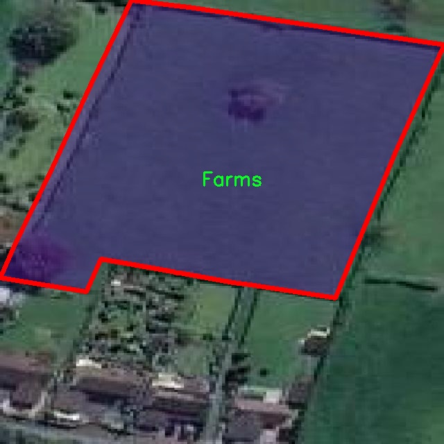

### 1.背景意义

研究背景与意义

随着全球人口的不断增长，农业生产面临着前所未有的挑战。为了提高粮食产量和农业效率，现代农业亟需借助先进的技术手段来实现精准管理和智能化监控。在这一背景下，计算机视觉技术的应用逐渐成为农业领域的重要趋势，尤其是在农田实例分割方面。实例分割技术不仅能够识别图像中的目标物体，还能精确到每个物体的轮廓，为农业生产提供了更为细致的数据支持。

本研究旨在基于改进的YOLOv11模型，构建一个高效的农田实例分割系统。该系统将专注于对农田区域的精准识别与分割，利用4500张标注良好的农田图像数据集，旨在提升农田管理的智能化水平。数据集中仅包含一个类别“Farms”，这为模型的训练和优化提供了明确的方向。通过对农田的实例分割，系统能够有效识别出不同的农田区域，为后续的作物监测、病虫害防治及精准施肥等提供重要的基础数据。

此外，随着深度学习技术的不断发展，YOLO系列模型在目标检测和实例分割领域表现出色。YOLOv11作为该系列的最新版本，结合了更为先进的网络结构和算法优化，能够在保持高精度的同时实现更快的推理速度。因此，基于YOLOv11的农田实例分割系统不仅具有理论研究的价值，更具备实际应用的潜力，能够为农业生产提供智能化的解决方案，推动农业现代化进程。

综上所述，本研究不仅填补了农田实例分割领域的技术空白，也为未来的农业智能化发展提供了新的思路和方法，具有重要的学术价值和实际意义。

### 2.视频效果

[2.1 视频效果](https://www.bilibili.com/video/BV1xjqqY7E8f/)

### 3.图片效果


##### [项目涉及的源码数据来源链接](https://kdocs.cn/l/cszuIiCKVNis)**

注意：本项目提供训练的数据集和训练教程,由于版本持续更新,暂不提供权重文件（best.pt）,请按照6.训练教程进行训练后实现上图演示的效果。

### 4.数据集信息

##### 4.1 本项目数据集类别数＆类别名

nc: 1
names: ['Farms']


该项目为【图像分割】数据集，请在【训练教程和Web端加载模型教程（第三步）】这一步的时候按照【图像分割】部分的教程来训练

##### 4.2 本项目数据集信息介绍

本项目数据集信息介绍

本项目旨在改进YOLOv11的农田实例分割系统，为此我们构建了一个专门针对农田场景的数据集，命名为“Dataset 1”。该数据集的设计初衷是为了解决农业领域中对农田识别和分割的需求，尤其是在精准农业和智能农业管理中，能够提供更为精确的农田边界和特征提取。数据集中包含的类别数量为1，具体类别为“Farms”，这意味着所有的标注和数据收集均围绕农田这一主题展开。

在数据集的构建过程中，我们综合考虑了多种农田的特征和环境变量，确保数据的多样性和代表性。数据集包含了不同季节、不同气候条件下的农田图像，涵盖了各种作物类型和生长阶段。这种多样性不仅增强了模型的泛化能力，也使得其在实际应用中能够更好地适应不同的农业场景。此外，数据集中的图像经过精细标注，确保每个农田实例都被准确地识别和分割，为YOLOv11的训练提供了高质量的输入。

在数据收集过程中，我们采用了高分辨率的图像采集技术，以确保细节的清晰度和准确性。数据集中的图像来源于多个地区的农田，涵盖了不同的地形和种植模式，这使得我们的模型能够学习到更为丰富的特征信息。通过对这些图像进行处理和标注，我们期望能够提升YOLOv11在农田实例分割任务中的性能，使其在实际应用中能够有效地识别和分割农田区域，从而为农业管理提供有力的技术支持。总之，“Dataset 1”不仅是一个简单的数据集合，更是一个推动农业智能化发展的重要资源。





### 5.全套项目环境部署视频教程（零基础手把手教学）

[5.1 所需软件PyCharm和Anaconda安装教程（第一步）](https://www.bilibili.com/video/BV1BoC1YCEKi/?spm_id_from=333.999.0.0&vd_source=bc9aec86d164b67a7004b996143742dc)


[5.2 安装Python虚拟环境创建和依赖库安装视频教程（第二步）](https://www.bilibili.com/video/BV1ZoC1YCEBw?spm_id_from=333.788.videopod.sections&vd_source=bc9aec86d164b67a7004b996143742dc)

### 6.改进YOLOv11训练教程和Web_UI前端加载模型教程（零基础手把手教学）

[6.1 改进YOLOv11训练教程和Web_UI前端加载模型教程（第三步）](https://www.bilibili.com/video/BV1BoC1YCEhR?spm_id_from=333.788.videopod.sections&vd_source=bc9aec86d164b67a7004b996143742dc)


按照上面的训练视频教程链接加载项目提供的数据集，运行train.py即可开始训练



     Epoch   gpu_mem       box       obj       cls    labels  img_size
     1/200     20.8G   0.01576   0.01955  0.007536        22      1280: 100%|██████████| 849/849 [14:42<00:00,  1.04s/it]
               Class     Images     Labels          P          R     mAP@.5 mAP@.5:.95: 100%|██████████| 213/213 [01:14<00:00,  2.87it/s]
                 all       3395      17314      0.994      0.957      0.0957      0.0843

     Epoch   gpu_mem       box       obj       cls    labels  img_size
     2/200     20.8G   0.01578   0.01923  0.007006        22      1280: 100%|██████████| 849/849 [14:44<00:00,  1.04s/it]
               Class     Images     Labels          P          R     mAP@.5 mAP@.5:.95: 100%|██████████| 213/213 [01:12<00:00,  2.95it/s]
                 all       3395      17314      0.996      0.956      0.0957      0.0845

     Epoch   gpu_mem       box       obj       cls    labels  img_size
     3/200     20.8G   0.01561    0.0191  0.006895        27      1280: 100%|██████████| 849/849 [10:56<00:00,  1.29it/s]
               Class     Images     Labels          P          R     mAP@.5 mAP@.5:.95: 100%|███████   | 187/213 [00:52<00:00,  4.04it/s]
                 all       3395      17314      0.996      0.957      0.0957      0.0845


###### [项目数据集下载链接](https://kdocs.cn/l/cszuIiCKVNis)

### 7.原始YOLOv11算法讲解

YOLOv11是一种由Ultralytics公司开发的最新一代目标检测模型，以其增强的特征提取能力和更高的效率在计算机视觉领域引人注目。该模型在架构上进行了关键升级，通过更新主干和颈部结构，显著提高了对复杂视觉场景的理解和处理精度。YOLOv11不仅在目标检测上表现出色，还支持实例分割、图像分类、姿态估计和定向目标检测（OBB）等任务，展示出其多功能性。

与其前身YOLOv8相比，YOLOv11在设计上实现了深度和宽度的改变，同时引入了几个创新机制。其中，C3k2机制是对YOLOv8中的C2f的改进，提升了浅层特征的处理能力；C2PSA机制则进一步优化了特征图的处理流程。解耦头的创新设计，通过增加两个深度卷积（DWConv），提高了模型对细节的感知能力和分类准确性。

在性能上，YOLOv11m模型在COCO数据集上的平均精度（mAP）提高，并减少了22%的参数量，确保了在运算效率上的突破。该模型可以部署在多种平台上，包括边缘设备、云平台以及支持NVIDIA GPU的系统，彰显出卓越的灵活性和适应性。总体而言，YOLOv11通过一系列的创新突破，对目标检测领域产生了深远的影响，并为未来的开发提供了新的研究方向。


****文档**** ： _ _https://docs.ultralytics.com/models/yolo11/__

****代码链接**** ： _ _https://github.com/ultralytics/ultralytics__

******Performance Metrics******


​ ** **关键特性****

****◆**** ** **增强的特征提取能力**** ：YOLO11采用了改进的主干和颈部架构，增强了 ** **特征提取****
能力，能够实现更精确的目标检测和复杂任务的执行。

****◆**** ** **优化的效率和速度****
：YOLO11引入了精细化的架构设计和优化的训练流程，提供更快的处理速度，并在准确性和性能之间保持最佳平衡。

****◆**** ** **参数更少、精度更高****
：通过模型设计的改进，YOLO11m在COCO数据集上实现了更高的平均精度（mAP），同时使用的参数比YOLOv8m少22%，使其在计算上更加高效，而不牺牲准确性。

****◆**** ** **跨环境的适应性**** ：YOLO11可以无缝部署在各种环境中，包括边缘设备、云平台和支持NVIDIA
GPU的系统，确保最大的灵活性。

****◆**** ** **支持广泛任务****
：无论是目标检测、实例分割、图像分类、姿态估计还是定向目标检测（OBB），YOLO11都旨在应对一系列计算机视觉挑战。

****支持的任务和模式****


​YOLO11建立在YOLOv8中引入的多功能模型范围之上，为各种计算机视觉任务提供增强的支持:


​该表提供了YOLO11模型变体的概述，展示了它们在特定任务中的适用性以及与Inference、Validation、Training和Export等操作模式的兼容性。从实时检测到复杂的分割任务
，这种灵活性使YOLO11适用于计算机视觉的广泛应用。

##### yolov11的创新

■ yolov8 VS yolov11

YOLOv5，YOLOv8和YOLOv11均是ultralytics公司的作品，ultralytics出品必属精品。


​ **具体创新点** ：

**① 深度（depth）和宽度 （width）**

YOLOv8和YOLOv11是基本上完全不同。

**② C3k2机制**

C3k2有参数为c3k，其中在网络的浅层c3k设置为False。C3k2就相当于YOLOv8中的C2f。


​ **③ C2PSA机制**

下图为C2PSA机制的原理图。


​ **④ 解耦头**

解耦头中的分类检测头增加了两个 **DWConv** 。


▲Conv

    
    
    def autopad(k, p=None, d=1):  # kernel, padding, dilation
    
        """Pad to 'same' shape outputs."""
    
        if d > 1:
    
            k = d * (k - 1) + 1 if isinstance(k, int) else [d * (x - 1) + 1 for x in k]  # actual kernel-size
    
        if p is None:
    
            p = k // 2 if isinstance(k, int) else [x // 2 for x in k]  # auto-pad
    
    return p
    
    
    class Conv(nn.Module):
    
        """Standard convolution with args(ch_in, ch_out, kernel, stride, padding, groups, dilation, activation)."""
    
    
        default_act = nn.SiLU()  # default activation
    
    
        def __init__(self, c1, c2, k=1, s=1, p=None, g=1, d=1, act=True):
    
            """Initialize Conv layer with given arguments including activation."""
    
            super().__init__()
    
            self.conv = nn.Conv2d(c1, c2, k, s, autopad(k, p, d), groups=g, dilation=d, bias=False)
    
            self.bn = nn.BatchNorm2d(c2)
    
            self.act = self.default_act if act is True else act if isinstance(act, nn.Module) else nn.Identity()
    
    
        def forward(self, x):
    
            """Apply convolution, batch normalization and activation to input tensor."""
    
            return self.act(self.bn(self.conv(x)))
    
    
        def forward_fuse(self, x):
    
            """Perform transposed convolution of 2D data."""
    
            return self.act(self.conv(x))

▲Conv2d

    
    
    torch.nn.Conv2d(in_channels, out_channels, kernel_size, stride=1, padding=0, dilation=1, groups=1, bias=True, padding_mode='zeros')

▲DWConv

DWConv ** **代表 Depthwise Convolution（深度卷积）****
，是一种在卷积神经网络中常用的高效卷积操作。它主要用于减少计算复杂度和参数量。

    
    
    class DWConv(Conv):
    
        """Depth-wise convolution."""
    
    
        def __init__(self, c1, c2, k=1, s=1, d=1, act=True):  # ch_in, ch_out, kernel, stride, dilation, activation
    
            """Initialize Depth-wise convolution with given parameters."""
    
            super().__init__(c1, c2, k, s, g=math.gcd(c1, c2), d=d, act=act)


### 8.200+种全套改进YOLOV11创新点原理讲解

#### 8.1 200+种全套改进YOLOV11创新点原理讲解大全

由于篇幅限制，每个创新点的具体原理讲解就不全部展开，具体见下列网址中的改进模块对应项目的技术原理博客网址【Blog】（创新点均为模块化搭建，原理适配YOLOv5~YOLOv11等各种版本）

[改进模块技术原理博客【Blog】网址链接](https://gitee.com/qunmasj/good)


#### 8.2 精选部分改进YOLOV11创新点原理讲解

###### 这里节选部分改进创新点展开原理讲解(完整的改进原理见上图和[改进模块技术原理博客链接](https://gitee.com/qunmasj/good)【如果此小节的图加载失败可以通过CSDN或者Github搜索该博客的标题访问原始博客，原始博客图片显示正常】

### 可扩张残差（DWR）注意力模块
当前的许多工作直接采用多速率深度扩张卷积从一个输入特征图中同时捕获多尺度上下文信息，从而提高实时语义分割的特征提取效率。 然而，这种设计可能会因为结构和超参数的不合理而导致多尺度上下文信息的访问困难。 为了降低绘制多尺度上下文信息的难度，我们提出了一种高效的多尺度特征提取方法，该方法分解了原始的单步特征提取方法方法分为两个步骤，区域残差-语义残差。 在该方法中，多速率深度扩张卷积在特征提取中发挥更简单的作用：根据第一步提供的每个简明区域形式特征图，在第二步中使用一个所需的感受野执行简单的基于语义的形态过滤 一步，提高他们的效率。 此外，扩张率和扩张卷积的容量每个网络阶段都经过精心设计，以充分利用所有可以实现的区域形式的特征图。 因此，我们分别为高层和低层网络设计了一种新颖的扩张式残差（DWR）模块和简单倒置残差（SIR）模块。


首先，该博客引入了一个Dilation-wise Residual（DWR）模块，用于提取网络高层的特征，如图2a所示。多分支结构用于扩展感受野，其中每个分支采用不同空洞率的空洞深度卷积。
然后，专门设计了一个Simple Inverted Residual（SIR）模块来提取网络低层的特征，如图2b所示。该模块仅具有3×3的微小感受野，但使用inverted bottleneck式结构来扩展通道数量，确保更强的特征提取能力。
最后，基于DWR和SIR模块，构建了一个编码器-解码器风格的网络DWRSeg，其中解码器采用了简单的类似FCN的结构。解码器使用来自最后两个阶段的强语义信息直接对特征图进行上采样，然后将它们与来自较低阶段的特征图（包含丰富的详细信息）拼接起来，以进行最终预测。


### 9.系统功能展示

图9.1.系统支持检测结果表格显示

  图9.2.系统支持置信度和IOU阈值手动调节

  图9.3.系统支持自定义加载权重文件best.pt(需要你通过步骤5中训练获得)

  图9.4.系统支持摄像头实时识别

  图9.5.系统支持图片识别

  图9.6.系统支持视频识别

  图9.7.系统支持识别结果文件自动保存

  图9.8.系统支持Excel导出检测结果数据


### 10. YOLOv11核心改进源码讲解

#### 10.1 hcfnet.py

以下是对代码中最核心部分的提取和详细注释：

```python
import math
import torch
import torch.nn as nn
import torch.nn.functional as F

# 定义空间注意力模块
class SpatialAttentionModule(nn.Module):
    def __init__(self):
        super(SpatialAttentionModule, self).__init__()
        # 使用卷积层来生成空间注意力图
        self.conv2d = nn.Conv2d(in_channels=2, out_channels=1, kernel_size=7, stride=1, padding=3)
        self.sigmoid = nn.Sigmoid()  # 使用Sigmoid激活函数

    def forward(self, x):
        # 计算输入特征图的平均值和最大值
        avgout = torch.mean(x, dim=1, keepdim=True)  # 平均池化
        maxout, _ = torch.max(x, dim=1, keepdim=True)  # 最大池化
        out = torch.cat([avgout, maxout], dim=1)  # 将平均值和最大值拼接
        out = self.sigmoid(self.conv2d(out))  # 通过卷积和Sigmoid激活生成注意力图
        return out * x  # 将注意力图应用于输入特征图

# 定义局部-全局注意力模块
class LocalGlobalAttention(nn.Module):
    def __init__(self, output_dim, patch_size):
        super().__init__()
        self.output_dim = output_dim
        self.patch_size = patch_size
        # 定义两个全连接层
        self.mlp1 = nn.Linear(patch_size * patch_size, output_dim // 2)
        self.norm = nn.LayerNorm(output_dim // 2)
        self.mlp2 = nn.Linear(output_dim // 2, output_dim)
        self.conv = nn.Conv2d(output_dim, output_dim, kernel_size=1)  # 1x1卷积
        self.prompt = torch.nn.parameter.Parameter(torch.randn(output_dim, requires_grad=True)) 
        self.top_down_transform = torch.nn.parameter.Parameter(torch.eye(output_dim), requires_grad=True)

    def forward(self, x):
        x = x.permute(0, 2, 3, 1)  # 调整维度顺序
        B, H, W, C = x.shape  # 获取批量大小、高度、宽度和通道数
        P = self.patch_size

        # 局部分支
        local_patches = x.unfold(1, P, P).unfold(2, P, P)  # 提取局部补丁
        local_patches = local_patches.reshape(B, -1, P * P, C)  # 重新调整形状
        local_patches = local_patches.mean(dim=-1)  # 对每个补丁进行平均

        local_patches = self.mlp1(local_patches)  # 通过第一个全连接层
        local_patches = self.norm(local_patches)  # 归一化
        local_patches = self.mlp2(local_patches)  # 通过第二个全连接层

        local_attention = F.softmax(local_patches, dim=-1)  # 计算局部注意力
        local_out = local_patches * local_attention  # 应用注意力

        # 计算余弦相似度并生成掩码
        cos_sim = F.normalize(local_out, dim=-1) @ F.normalize(self.prompt[None, ..., None], dim=1)  # 计算余弦相似度
        mask = cos_sim.clamp(0, 1)  # 限制在[0, 1]范围内
        local_out = local_out * mask  # 应用掩码
        local_out = local_out @ self.top_down_transform  # 进行变换

        # 恢复形状
        local_out = local_out.reshape(B, H // P, W // P, self.output_dim)  # 调整形状
        local_out = local_out.permute(0, 3, 1, 2)  # 调整维度顺序
        local_out = F.interpolate(local_out, size=(H, W), mode='bilinear', align_corners=False)  # 上采样
        output = self.conv(local_out)  # 通过1x1卷积生成输出

        return output

# 定义PPA模块
class PPA(nn.Module):
    def __init__(self, in_features, filters) -> None:
        super().__init__()
        # 定义各个卷积层和注意力模块
        self.skip = nn.Conv2d(in_features, filters, kernel_size=1, bias=False)
        self.c1 = nn.Conv2d(filters, filters, kernel_size=3, padding=1)
        self.c2 = nn.Conv2d(filters, filters, kernel_size=3, padding=1)
        self.c3 = nn.Conv2d(filters, filters, kernel_size=3, padding=1)
        self.sa = SpatialAttentionModule()  # 空间注意力模块
        self.lga2 = LocalGlobalAttention(filters, 2)  # 局部-全局注意力模块
        self.lga4 = LocalGlobalAttention(filters, 4)  # 局部-全局注意力模块
        self.bn1 = nn.BatchNorm2d(filters)  # 批归一化
        self.silu = nn.SiLU()  # SiLU激活函数

    def forward(self, x):
        x_skip = self.skip(x)  # 跳跃连接
        x_lga2 = self.lga2(x_skip)  # 局部-全局注意力
        x_lga4 = self.lga4(x_skip)  # 局部-全局注意力
        x1 = self.c1(x)  # 卷积操作
        x2 = self.c2(x1)  # 卷积操作
        x3 = self.c3(x2)  # 卷积操作
        # 将所有特征图相加
        x = x1 + x2 + x3 + x_skip + x_lga2 + x_lga4
        x = self.bn1(x)  # 批归一化
        x = self.sa(x)  # 空间注意力
        x = self.silu(x)  # 激活函数
        return x  # 返回输出

# 定义DASI模块
class DASI(nn.Module):
    def __init__(self, in_features, out_features) -> None:
        super().__init__()
        self.tail_conv = nn.Conv2d(out_features, out_features, kernel_size=1)  # 尾部卷积
        self.skips = nn.Conv2d(in_features[1], out_features, kernel_size=1)  # 跳跃连接
        self.silu = nn.SiLU()  # SiLU激活函数

    def forward(self, x_list):
        x_low, x, x_high = x_list  # 解包输入
        x = self.skips(x)  # 跳跃连接
        x_skip = x  # 保存跳跃连接的输出
        x = torch.chunk(x, 4, dim=1)  # 将特征图分成4个部分

        # 处理高低特征图
        if x_high is not None:
            x_high = self.skips(x_high)
            x_high = torch.chunk(x_high, 4, dim=1)
        if x_low is not None:
            x_low = self.skips(x_low)
            x_low = F.interpolate(x_low, size=[x.size(2), x.size(3)], mode='bilinear', align_corners=True)
            x_low = torch.chunk(x_low, 4, dim=1)

        # 结合高低特征图
        x0 = x[0] + (x_low[0] if x_low is not None else 0) + (x_high[0] if x_high is not None else 0)
        x1 = x[1] + (x_low[1] if x_low is not None else 0) + (x_high[1] if x_high is not None else 0)
        x2 = x[2] + (x_low[2] if x_low is not None else 0) + (x_high[2] if x_high is not None else 0)
        x3 = x[3] + (x_low[3] if x_low is not None else 0) + (x_high[3] if x_high is not None else 0)

        x = torch.cat((x0, x1, x2, x3), dim=1)  # 合并特征图
        x = self.tail_conv(x)  # 尾部卷积
        x += x_skip  # 加上跳跃连接
        x = self.silu(x)  # 激活函数
        return x  # 返回输出
```

### 代码核心部分分析：
1. **空间注意力模块（SpatialAttentionModule）**：通过平均池化和最大池化生成空间注意力图，并将其应用于输入特征图。
2. **局部-全局注意力模块（LocalGlobalAttention）**：通过局部补丁提取和全连接层生成局部特征，并结合全局特征进行注意力计算。
3. **PPA模块**：结合卷积层、空间注意力和局部-全局注意力，整合多种特征信息以生成最终输出。
4. **DASI模块**：通过跳跃连接和特征融合，结合高低层特征以生成更丰富的特征表示。

这些模块共同构成了一个复杂的神经网络架构，旨在提高特征提取和表示能力。

这个文件定义了一个深度学习模型的多个模块，主要用于图像处理任务。文件中包含了几个类，每个类实现了特定的功能，下面是对这些类的逐一分析。

首先，`SpatialAttentionModule`类实现了空间注意力机制。该模块通过计算输入特征图的平均值和最大值，生成一个包含这两种信息的特征图，然后通过一个卷积层和Sigmoid激活函数得到注意力权重。最后，这个权重与输入特征图相乘，以突出重要的空间区域。

接下来是`LocalGlobalAttention`类，它结合了局部和全局注意力机制。该模块首先将输入特征图划分为多个小块（patches），并对每个小块进行处理。通过两个多层感知机（MLP）对局部特征进行变换，并计算注意力权重。然后，它通过余弦相似度与一个可学习的提示向量进行计算，生成一个掩码，用于调整局部特征。最后，局部特征被上采样到原始尺寸，并通过一个卷积层输出。

`ECA`类实现了有效通道注意力机制。它通过自适应平均池化将输入特征图压缩为一个标量，然后通过一维卷积和Sigmoid激活函数生成通道注意力权重，最后将这个权重应用于输入特征图，以增强重要通道的特征。

`PPA`类是一个复合模块，结合了前面提到的多个模块。它首先通过卷积层进行特征提取，然后使用局部全局注意力模块和空间注意力模块来增强特征。最后，通过Batch Normalization和SiLU激活函数进行进一步处理，输出最终的特征图。

`Bag`类实现了一个简单的加权融合机制。它根据输入的注意力值对两个特征图进行加权融合，输出融合后的特征图。

最后，`DASI`类是一个更复杂的模块，负责将不同分辨率的特征图进行融合。它使用多个卷积层和跳跃连接，将低分辨率和高分辨率的特征图结合在一起。通过Bag模块对特征进行加权融合，最后通过尾部卷积和Batch Normalization进行处理，输出最终的特征图。

总体而言，这个文件实现了一个多层次、多模块的深度学习模型，结合了注意力机制和特征融合策略，旨在提高图像处理任务的性能。

#### 10.2 kaln_conv.py

以下是经过简化和注释的核心代码部分，主要保留了 `KALNConvNDLayer` 类及其重要方法：

```python
from functools import lru_cache
import torch
import torch.nn as nn

class KALNConvNDLayer(nn.Module):
    def __init__(self, conv_class, norm_class, conv_w_fun, input_dim, output_dim, degree, kernel_size,
                 groups=1, padding=0, stride=1, dilation=1, dropout: float = 0.0, ndim: int = 2):
        super(KALNConvNDLayer, self).__init__()
        
        # 初始化参数
        self.inputdim = input_dim  # 输入维度
        self.outdim = output_dim    # 输出维度
        self.degree = degree         # 多项式的阶数
        self.kernel_size = kernel_size  # 卷积核大小
        self.padding = padding       # 填充
        self.stride = stride         # 步幅
        self.dilation = dilation     # 膨胀
        self.groups = groups         # 分组卷积的组数
        self.base_activation = nn.SiLU()  # 基础激活函数
        self.conv_w_fun = conv_w_fun  # 卷积权重函数
        self.ndim = ndim             # 数据的维度
        self.dropout = None          # Dropout层初始化
        
        # 初始化Dropout层
        if dropout > 0:
            if ndim == 1:
                self.dropout = nn.Dropout1d(p=dropout)
            elif ndim == 2:
                self.dropout = nn.Dropout2d(p=dropout)
            elif ndim == 3:
                self.dropout = nn.Dropout3d(p=dropout)

        # 检查分组参数的有效性
        if groups <= 0:
            raise ValueError('groups must be a positive integer')
        if input_dim % groups != 0:
            raise ValueError('input_dim must be divisible by groups')
        if output_dim % groups != 0:
            raise ValueError('output_dim must be divisible by groups')

        # 创建卷积层和归一化层
        self.base_conv = nn.ModuleList([conv_class(input_dim // groups,
                                                   output_dim // groups,
                                                   kernel_size,
                                                   stride,
                                                   padding,
                                                   dilation,
                                                   groups=1,
                                                   bias=False) for _ in range(groups)])

        self.layer_norm = nn.ModuleList([norm_class(output_dim // groups) for _ in range(groups)])

        # 初始化多项式权重
        poly_shape = (groups, output_dim // groups, (input_dim // groups) * (degree + 1)) + tuple(
            kernel_size for _ in range(ndim))
        self.poly_weights = nn.Parameter(torch.randn(*poly_shape))

        # 使用Kaiming均匀分布初始化卷积层权重
        for conv_layer in self.base_conv:
            nn.init.kaiming_uniform_(conv_layer.weight, nonlinearity='linear')
        nn.init.kaiming_uniform_(self.poly_weights, nonlinearity='linear')

    @lru_cache(maxsize=128)  # 使用缓存避免重复计算
    def compute_legendre_polynomials(self, x, order):
        # 计算勒让德多项式
        P0 = x.new_ones(x.shape)  # P0 = 1
        if order == 0:
            return P0.unsqueeze(-1)
        P1 = x  # P1 = x
        legendre_polys = [P0, P1]

        # 递归计算高阶多项式
        for n in range(1, order):
            Pn = ((2.0 * n + 1.0) * x * legendre_polys[-1] - n * legendre_polys[-2]) / (n + 1.0)
            legendre_polys.append(Pn)

        return torch.concatenate(legendre_polys, dim=1)

    def forward_kal(self, x, group_index):
        # 前向传播
        base_output = self.base_conv[group_index](x)  # 基础卷积输出

        # 归一化输入
        x_normalized = 2 * (x - x.min()) / (x.max() - x.min()) - 1 if x.shape[0] > 0 else x

        # 应用Dropout
        if self.dropout is not None:
            x_normalized = self.dropout(x_normalized)

        # 计算勒让德多项式
        legendre_basis = self.compute_legendre_polynomials(x_normalized, self.degree)
        # 使用多项式权重进行线性变换
        poly_output = self.conv_w_fun(legendre_basis, self.poly_weights[group_index],
                                      stride=self.stride, dilation=self.dilation,
                                      padding=self.padding, groups=1)

        # 合并基础输出和多项式输出
        x = base_output + poly_output
        # 归一化和激活
        x = self.layer_norm[group_index](x)
        x = self.base_activation(x)

        return x

    def forward(self, x):
        # 主前向传播方法
        split_x = torch.split(x, self.inputdim // self.groups, dim=1)  # 按组分割输入
        output = []
        for group_ind, _x in enumerate(split_x):
            y = self.forward_kal(_x.clone(), group_ind)  # 对每个组进行前向传播
            output.append(y.clone())
        y = torch.cat(output, dim=1)  # 合并所有组的输出
        return y
```

### 代码说明：
1. **类初始化**：`__init__` 方法中初始化了卷积层、归一化层和多项式权重，并进行了必要的参数检查。
2. **勒让德多项式计算**：`compute_legendre_polynomials` 方法计算给定阶数的勒让德多项式，并使用缓存来提高效率。
3. **前向传播**：`forward_kal` 方法实现了对每个组的前向传播，包括基础卷积、勒让德多项式计算、输出合并和激活。
4. **主前向传播**：`forward` 方法将输入按组分割，并对每个组调用 `forward_kal`，最后合并输出。

这个程序文件定义了一个名为 `KALNConvNDLayer` 的神经网络层及其一维、二维和三维的具体实现。该层结合了卷积操作和多项式基函数，旨在增强模型的表达能力。

首先，`KALNConvNDLayer` 类的构造函数接收多个参数，包括卷积类型、归一化类型、输入和输出维度、卷积核大小、分组数、填充、步幅、扩张率以及丢弃率等。它通过这些参数初始化卷积层、归一化层和多项式权重。多项式权重是通过正态分布随机初始化的，并且使用 Kaiming 均匀分布进行权重初始化，以便在训练开始时获得更好的效果。

在 `compute_legendre_polynomials` 方法中，使用递归关系计算勒让德多项式。该方法使用了 `lru_cache` 装饰器来缓存计算结果，以避免重复计算，提高效率。

`forward_kal` 方法是该层的核心计算逻辑。它首先对输入进行基础卷积操作，然后对输入进行归一化处理，并计算勒让德多项式。接着，使用多项式权重进行线性变换，最后将基础输出和多项式输出相加，并通过归一化和激活函数进行处理。

`forward` 方法则是处理整个输入张量的逻辑。它将输入张量按组分割，然后对每个组调用 `forward_kal` 方法，最后将所有组的输出拼接在一起。

此外，文件中还定义了三个子类：`KALNConv3DLayer`、`KALNConv2DLayer` 和 `KALNConv1DLayer`，分别用于实现三维、二维和一维的卷积层。这些子类通过调用父类的构造函数，传入相应的卷积和归一化层类型，简化了不同维度卷积层的实现。

总体而言，这个程序文件实现了一种灵活且高效的卷积层，能够处理不同维度的输入，并结合多项式基函数来增强模型的表现能力。

#### 10.3 block.py

以下是经过简化并注释的核心代码部分，主要保留了关键的类和函数，便于理解其功能和实现逻辑。

```python
import torch
import torch.nn as nn
import torch.nn.functional as F

# 自动填充函数，用于保持输出形状与输入相同
def autopad(k, p=None, d=1):
    """Pad to 'same' shape outputs."""
    if d > 1:
        k = d * (k - 1) + 1 if isinstance(k, int) else [d * (x - 1) + 1 for x in k]  # 实际的卷积核大小
    if p is None:
        p = k // 2 if isinstance(k, int) else [x // 2 for x in k]  # 自动填充
    return p

# 定义一个Swish激活函数
class swish(nn.Module):
    def forward(self, x):
        return x * torch.sigmoid(x)

# 定义一个带有ReLU6激活的h_swish
class h_swish(nn.Module):
    def __init__(self, inplace=False):
        super(h_swish, self).__init__()
        self.inplace = inplace

    def forward(self, x):
        return x * F.relu6(x + 3.0, inplace=self.inplace) / 6.0

# 定义一个带有h_sigmoid激活的类
class h_sigmoid(nn.Module):
    def __init__(self, inplace=True):
        super(h_sigmoid, self).__init__()
        self.relu = nn.ReLU6(inplace=inplace)

    def forward(self, x):
        return self.relu(x + 3) / 6

# 动态ReLU模块
class DyReLU(nn.Module):
    def __init__(self, inp, reduction=4):
        super(DyReLU, self).__init__()
        self.oup = inp
        squeeze = inp // reduction
        self.fc = nn.Sequential(
            nn.Linear(inp, squeeze),
            nn.ReLU(inplace=True),
            nn.Linear(squeeze, self.oup * 2),
            h_sigmoid()
        )

    def forward(self, x):
        y = self.fc(x)
        a1, b1 = torch.split(y, self.oup, dim=1)
        return x * a1 + b1  # 动态ReLU输出

# 定义一个标准的瓶颈结构
class Bottleneck(nn.Module):
    def __init__(self, c1, c2, shortcut=True):
        super().__init__()
        self.cv1 = nn.Conv2d(c1, c2, kernel_size=1)
        self.cv2 = nn.Conv2d(c2, c2, kernel_size=3, padding=1)
        self.add = shortcut and c1 == c2

    def forward(self, x):
        return x + self.cv2(self.cv1(x)) if self.add else self.cv2(self.cv1(x))

# 定义一个C3k结构，包含多个瓶颈层
class C3k(nn.Module):
    def __init__(self, c1, c2, n=1, shortcut=False):
        super().__init__()
        self.m = nn.Sequential(*(Bottleneck(c1, c2, shortcut) for _ in range(n)))

    def forward(self, x):
        return self.m(x)

# 定义一个上下文引导块
class ContextGuidedBlock(nn.Module):
    def __init__(self, nIn, nOut):
        super().__init__()
        self.conv1x1 = nn.Conv2d(nIn, nOut, 1)
        self.F_loc = nn.Conv2d(nOut, nOut, 3, padding=1, groups=nOut)
        self.F_sur = nn.Conv2d(nOut, nOut, 3, padding=1, dilation=2, groups=nOut)

    def forward(self, input):
        output = self.conv1x1(input)
        loc = self.F_loc(output)
        sur = self.F_sur(output)
        return loc + sur  # 返回局部和全局特征的结合

# 定义一个特征金字塔聚合模块
class PyramidPoolAgg(nn.Module):
    def __init__(self, inc, ouc):
        super().__init__()
        self.conv = nn.Conv2d(inc, ouc, kernel_size=1)

    def forward(self, inputs):
        return self.conv(torch.cat([F.adaptive_avg_pool2d(inp, 1) for inp in inputs], dim=1))

# 定义一个简单的注意力模块
class SimpleAttention(nn.Module):
    def __init__(self, in_channels):
        super(SimpleAttention, self).__init__()
        self.conv1 = nn.Conv2d(in_channels, in_channels // 16, kernel_size=1)
        self.conv2 = nn.Conv2d(in_channels // 16, in_channels, kernel_size=1)

    def forward(self, x):
        attn = self.conv2(F.relu(self.conv1(x)))
        return x * attn  # 应用注意力机制

# 组合特征的主模块
class FeatureFusionModule(nn.Module):
    def __init__(self, inc, ouc):
        super().__init__()
        self.conv1 = nn.Conv2d(inc, ouc, kernel_size=1)

    def forward(self, x):
        return self.conv1(x[0] + x[1])  # 特征融合

# 定义一个整体的网络结构
class MyNetwork(nn.Module):
    def __init__(self):
        super().__init__()
        self.backbone = C3k(3, 64, n=2)  # 输入3通道，输出64通道，包含2个瓶颈层
        self.context_block = ContextGuidedBlock(64, 128)  # 上下文引导块
        self.fusion_module = FeatureFusionModule(128, 256)  # 特征融合模块

    def forward(self, x):
        x = self.backbone(x)
        x = self.context_block(x)
        x = self.fusion_module((x, x))  # 融合特征
        return x
```

### 代码注释说明：
1. **autopad**: 用于计算卷积的填充，以保持输入输出形状一致。
2. **swish, h_swish, h_sigmoid**: 自定义激活函数。
3. **DyReLU**: 动态ReLU模块，根据输入动态调整输出。
4. **Bottleneck**: 标准的瓶颈结构，包含两个卷积层。
5. **C3k**: 由多个瓶颈层组成的模块。
6. **ContextGuidedBlock**: 结合局部和全局特征的块。
7. **PyramidPoolAgg**: 特征金字塔聚合模块。
8. **SimpleAttention**: 简单的注意力机制模块。
9. **FeatureFusionModule**: 特征融合模块，结合两个输入特征。
10. **MyNetwork**: 整体网络结构，包含主干网络、上下文引导块和特征融合模块。

通过以上注释，代码的核心逻辑和结构变得更加清晰，便于理解和修改。

这个 `block.py` 文件包含了多个深度学习模型中使用的模块和层，主要是用于构建卷积神经网络（CNN）和注意力机制的组件。以下是对文件中主要内容的详细说明：

首先，文件引入了多个库，包括 `torch` 和 `torch.nn`，这些是 PyTorch 的核心库，用于构建和训练神经网络。文件中还引入了一些自定义模块和函数，如 `Conv`、`DWConv`、`DSConv` 等，这些都是自定义的卷积层。

接下来，文件定义了一系列的类，每个类代表一个特定的网络模块或层。这些模块通常是由多个卷积层、激活函数、归一化层等组成的复合结构。以下是一些重要模块的概述：

1. **Bottleneck**：这是一个标准的瓶颈结构，通常用于深度残差网络中。它通过减少特征图的维度来提高计算效率。

2. **C3k 和 C3k2**：这些类是基于瓶颈结构的变体，支持不同的参数设置，如通道数、层数等。它们可以用于构建更复杂的网络结构。

3. **注意力机制**：文件中包含了多种注意力机制的实现，如 `GOLDYOLO_Attention`、`PSA`、`SMA` 等。这些机制通过计算特征图中不同位置的重要性来增强模型的表达能力。

4. **动态卷积**：如 `DynamicConv` 和 `DynamicConv_Single`，这些模块实现了动态卷积的功能，允许在推理时根据输入动态调整卷积核。

5. **多尺度特征融合**：模块如 `PyramidPoolAgg` 和 `PMSFA` 实现了多尺度特征的聚合，能够有效地结合不同尺度的信息。

6. **边缘信息增强**：如 `SobConv` 和 `EIEStem`，这些模块专注于提取和增强图像中的边缘特征，以提高模型对细节的捕捉能力。

7. **自适应卷积**：如 `FocalModulation` 和 `AdaptiveDilatedConv`，这些模块通过自适应调整卷积核的大小和形状来提高模型的灵活性。

8. **各种变体**：文件中还定义了多种网络变体，如 `C3k_RVB`、`C3k_DWR` 等，这些变体通过组合不同的模块和层来实现特定的功能或性能优化。

总的来说，`block.py` 文件提供了构建现代卷积神经网络所需的多种基础组件和高级功能，支持多种网络架构和应用场景。每个模块都经过精心设计，以便在特定任务中实现更好的性能。

#### 10.4 convnextv2.py

以下是代码中最核心的部分，并附上详细的中文注释：

```python
import torch
import torch.nn as nn
import torch.nn.functional as F

class LayerNorm(nn.Module):
    """ 自定义的LayerNorm层，支持两种数据格式：channels_last（默认）或channels_first。
    channels_last对应输入形状为(batch_size, height, width, channels)，
    而channels_first对应输入形状为(batch_size, channels, height, width)。
    """
    def __init__(self, normalized_shape, eps=1e-6, data_format="channels_last"):
        super().__init__()
        # 权重和偏置参数
        self.weight = nn.Parameter(torch.ones(normalized_shape))
        self.bias = nn.Parameter(torch.zeros(normalized_shape))
        self.eps = eps  # 防止除零的微小值
        self.data_format = data_format
        if self.data_format not in ["channels_last", "channels_first"]:
            raise NotImplementedError 
        self.normalized_shape = (normalized_shape, )
    
    def forward(self, x):
        # 根据数据格式选择不同的归一化方式
        if self.data_format == "channels_last":
            return F.layer_norm(x, self.normalized_shape, self.weight, self.bias, self.eps)
        elif self.data_format == "channels_first":
            u = x.mean(1, keepdim=True)  # 计算均值
            s = (x - u).pow(2).mean(1, keepdim=True)  # 计算方差
            x = (x - u) / torch.sqrt(s + self.eps)  # 标准化
            x = self.weight[:, None, None] * x + self.bias[:, None, None]  # 应用权重和偏置
            return x

class Block(nn.Module):
    """ ConvNeXtV2中的基本模块。
    
    Args:
        dim (int): 输入通道数。
    """
    def __init__(self, dim):
        super().__init__()
        # 深度可分离卷积
        self.dwconv = nn.Conv2d(dim, dim, kernel_size=7, padding=3, groups=dim)
        self.norm = LayerNorm(dim, eps=1e-6)  # 使用自定义的LayerNorm
        self.pwconv1 = nn.Linear(dim, 4 * dim)  # 1x1卷积，使用线性层实现
        self.act = nn.GELU()  # 激活函数
        self.pwconv2 = nn.Linear(4 * dim, dim)  # 另一个1x1卷积

    def forward(self, x):
        input = x  # 保存输入以便后续残差连接
        x = self.dwconv(x)  # 深度卷积
        x = x.permute(0, 2, 3, 1)  # 转换维度顺序
        x = self.norm(x)  # 归一化
        x = self.pwconv1(x)  # 第一个1x1卷积
        x = self.act(x)  # 激活
        x = self.pwconv2(x)  # 第二个1x1卷积
        x = x.permute(0, 3, 1, 2)  # 恢复维度顺序

        x = input + x  # 残差连接
        return x

class ConvNeXtV2(nn.Module):
    """ ConvNeXt V2模型定义。
    
    Args:
        in_chans (int): 输入图像的通道数。默认值：3
        num_classes (int): 分类头的类别数。默认值：1000
        depths (tuple(int)): 每个阶段的块数。默认值：[3, 3, 9, 3]
        dims (int): 每个阶段的特征维度。默认值：[96, 192, 384, 768]
    """
    def __init__(self, in_chans=3, num_classes=1000, 
                 depths=[3, 3, 9, 3], dims=[96, 192, 384, 768]):
        super().__init__()
        self.downsample_layers = nn.ModuleList()  # 下采样层
        # 初始卷积层
        stem = nn.Sequential(
            nn.Conv2d(in_chans, dims[0], kernel_size=4, stride=4),
            LayerNorm(dims[0], eps=1e-6, data_format="channels_first")
        )
        self.downsample_layers.append(stem)
        # 添加后续的下采样层
        for i in range(3):
            downsample_layer = nn.Sequential(
                    LayerNorm(dims[i], eps=1e-6, data_format="channels_first"),
                    nn.Conv2d(dims[i], dims[i+1], kernel_size=2, stride=2),
            )
            self.downsample_layers.append(downsample_layer)

        self.stages = nn.ModuleList()  # 特征分辨率阶段
        for i in range(4):
            stage = nn.Sequential(
                *[Block(dim=dims[i]) for _ in range(depths[i])]
            )
            self.stages.append(stage)

        self.norm = nn.LayerNorm(dims[-1], eps=1e-6)  # 最后的归一化层
        self.head = nn.Linear(dims[-1], num_classes)  # 分类头

    def forward(self, x):
        for i in range(4):
            x = self.downsample_layers[i](x)  # 下采样
            x = self.stages[i](x)  # 特征提取
        return x  # 返回最后的特征图
```

### 代码核心部分说明：
1. **LayerNorm**: 自定义的层归一化实现，支持不同的输入格式，能够对输入进行标准化处理。
2. **Block**: ConvNeXtV2的基本构建块，包含深度卷积、归一化、激活函数和残差连接。
3. **ConvNeXtV2**: 主模型类，定义了输入层、下采样层和多个特征提取阶段，最后通过线性层输出分类结果。

这个程序文件定义了一个名为 ConvNeXtV2 的深度学习模型，主要用于图像分类任务。文件中包含多个类和函数，具体功能如下：

首先，文件导入了必要的库，包括 PyTorch 及其相关模块。接着，定义了一个 `LayerNorm` 类，这个类实现了层归一化（Layer Normalization），支持两种数据格式：通道在最后（channels_last）和通道在最前（channels_first）。在 `forward` 方法中，根据输入数据的格式进行相应的归一化处理。

接下来，定义了一个 `GRN` 类，表示全局响应归一化（Global Response Normalization）层。该层通过计算输入的 L2 范数来调整输入的响应，并通过可学习的参数 `gamma` 和 `beta` 来进行缩放和偏移。

然后，定义了一个 `Block` 类，表示 ConvNeXtV2 的基本构建块。这个块包含一个深度可分离卷积层、层归一化、点卷积层、激活函数（GELU）、GRN 层和另一个点卷积层。`drop_path` 用于实现随机深度，增强模型的泛化能力。在 `forward` 方法中，输入经过一系列的变换后与原始输入相加，形成残差连接。

`ConvNeXtV2` 类是模型的主要结构，初始化时接受多个参数，包括输入通道数、分类类别数、每个阶段的块数、特征维度、随机深度率等。模型的前半部分是下采样层，由多个卷积层和归一化层组成。后半部分是多个特征分辨率阶段，每个阶段由多个 `Block` 组成。最后，模型还包含一个归一化层和一个线性分类头。

文件中还定义了一个 `_init_weights` 方法，用于初始化模型的权重，采用截断正态分布和常数初始化。`forward` 方法则实现了模型的前向传播，依次通过下采样层和特征阶段，返回每个阶段的输出。

此外，文件还包含一个 `update_weight` 函数，用于更新模型的权重。这个函数会检查权重字典中的每个键是否在模型字典中，并且形状是否匹配，匹配的权重会被更新。

最后，文件提供了一系列函数（如 `convnextv2_atto`、`convnextv2_femto` 等），用于创建不同规模的 ConvNeXtV2 模型。这些函数可以加载预训练的权重，以便在特定任务上进行微调。

总体而言，这个文件实现了一个灵活且高效的图像分类模型，结合了现代深度学习中的多种技术，适用于各种应用场景。

### 11.完整训练+Web前端界面+200+种全套创新点源码、数据集获取


# [下载链接：https://mbd.pub/o/bread/Z5yZmZpt](https://mbd.pub/o/bread/Z5yZmZpt)